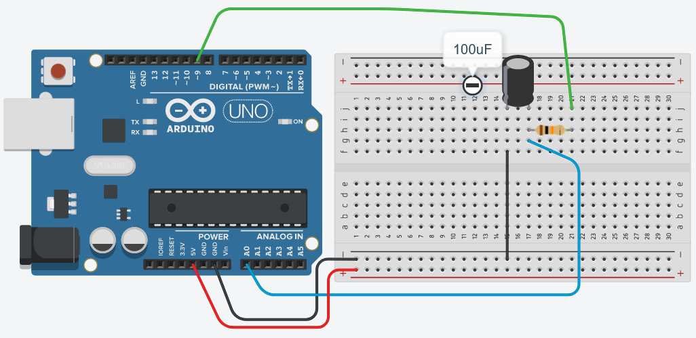
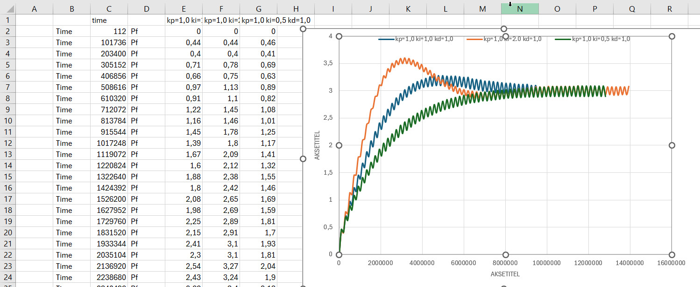

# Arduino_Projekter
## PID Regulator for Analog out over capacitor

This code will make a PID regulator of an Arduino PWM signal
a 10kOhm resistor and a 100uF capasitor.

Setup the circuit as shown here below, and run the code.

[!tip]
I have found that running the code with an PuTTY terminal, it is easier to 
save the Serial Monitor data for manipulatin in Excel.

